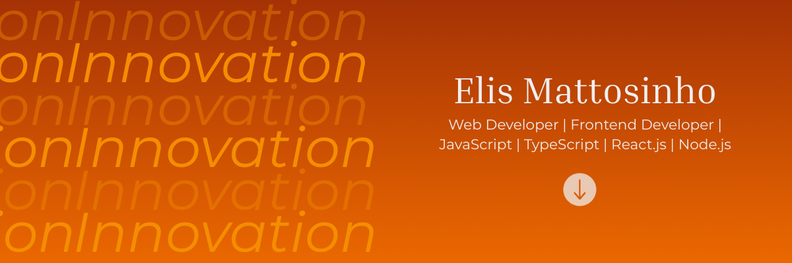
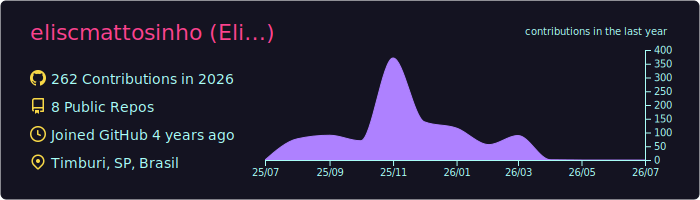
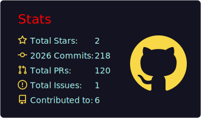
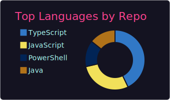
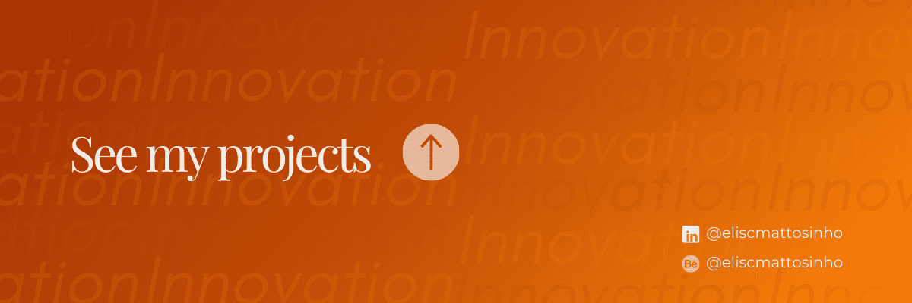

 

 

## About me

- Technologist in **Systems Analysis and Development** from Fatec Ourinhos.
- 🔍 Curious; 📚 bookstan; 🐾 pet tutor; and 👩‍🌾 raised in the countryside.
- I love learn, create and build better places.

### Values

### Contact

 

## Competencies

### Areas

-F24E1E?style=for-the-badge&logo=figma&logoColor=white)

 

### Soft Skills

- 🧠 Self-taught and committed to continuous learning
- 🤝 Effective collaboration in multidisciplinary teams
- 🕰️ Organization and time management
- ✨ Creativity applied to problem-solving
- 💪 Resilience and adaptability in the face of challenges

 

### Hard Skills

  
  
  

  
  

  
  
  
  

 
 

## GitHub Statistics

  

   

  
  

   

  

 
 

 

