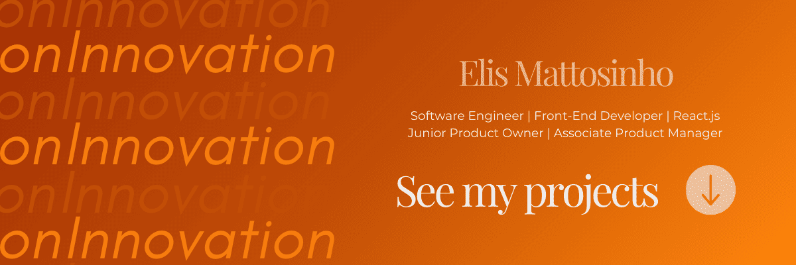

 
 

 

  ## About me
  - Technologist in <strong>Systems Analysis and Development</strong> from Fatec Ourinhos.

  - <strong>Values:</strong> Commitment to value creation, continuous learning, and teamwork collaboration.

  ### Contact

  
  
  
  

 

## Competencies

### Areas
- Digital product development;
- Interface design (UI/UX);
- Machine Learning;
- Process automation.

### Soft Skills
- Self-taught and committed to continuous learning.
- Effective collaboration in multidisciplinary teams.
- Organization and time management.
- Creativity applied to problem-solving.
- Resilience and adaptability in the face of challenges.

### Hard Skills

    
    
    
    
    
    

 
 

## GitHub Statistics

  

  

 
 
 

